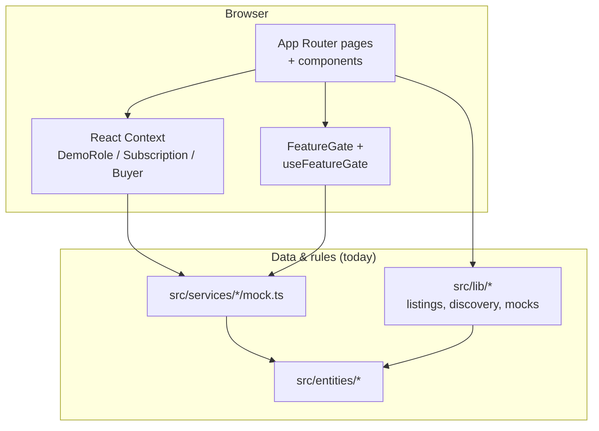
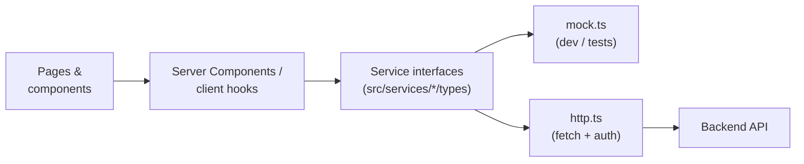

# Architecture

Документ описывает **текущее** состояние репозитория (аудит по коду), **целевую** схему после подключения API и практические гайды для разработчиков.

## Current architecture

Интерактивный слой — Next.js App Router; данные и правила доступа в основном приходят из **in-memory mocks** в `src/services` и статических модулей `src/lib`.

**Наблюдения:**

- Граница «UI ↔ данные» проходит через **сервисные интерфейсы** (`ListingsService`, `FeatureGateService`, …) и **прямые импорты** из `src/lib` там, где рефактор ещё не выделил сервис.
- `entities` задают типы планов, фич и DTO; моки сервисов собирают из них entitlement-подобные структуры.

## Target architecture

После появления бэкенда сервисы становятся фасадом над HTTP: один контракт, две реализации (mock для e2e/storybook и `http` для prod).

## Feature development guide

1. **Модель и типы** — при появлении новой сущности добавьте или расширьте `src/entities/<name>/` (типы, enum’ы, без React).
2. **Сервис** — объявите контракт в `src/services/<feature>/` (например `types.ts` + `index.ts`), реализуйте `mock.ts` с предсказуемыми данными для UI и тестов.
3. **UI** — страница в `src/app/...` и/или компоненты в `src/components/<feature>/`; для повторяющихся паттернов страницы используйте `@/components/platform`.
4. **Доступ по тарифу** — подключите `FeatureGate` / `useFeatureGate` и расширьте `Feature` в `entities/billing` + логику в `feature-gate/mock.ts` (позже — в серверной политике).
5. **Тесты** — доменная логика в `src/lib` / чистые функции → `*.test.ts`; UI-атомы с разметкой → `*.test.tsx` + `@vitest-environment jsdom` при необходимости.

## Service layer guide (mock → HTTP)

| Шаг | Действие |
|-----|----------|
| 1 | Зафиксируйте **интерфейс** сервиса в `types.ts` (уже есть для listings / feature-gate). |
| 2 | Вынесите общие DTO в `entities`, чтобы mock и HTTP возвращали один тип. |
| 3 | Добавьте `http.ts` (или `server.ts`) с `fetch`, базовым URL из env, обработкой ошибок и опционально React `cache()` для RSC. |
| 4 | В **одном месте** (например фабрика в `src/services/*/index.ts` или env-ветка в layout) выберите `mockListingsService` vs `httpListingsService`. |
| 5 | Сохраните моки для **Vitest** и локальной разработки без VPN; CI может гонять тесты только на моках. |
| 6 | Постепенно переводите вызовы с прямого импорта `lib` на сервис, чтобы маршрут миграции был однозначным. |

## Связанные документы

- [README.md](./README.md) — запуск, demo roles, policy по state.
- [DASHBOARD_REFACTOR.md](./DASHBOARD_REFACTOR.md) — декомпозиция дашборда магазина (если актуально).
