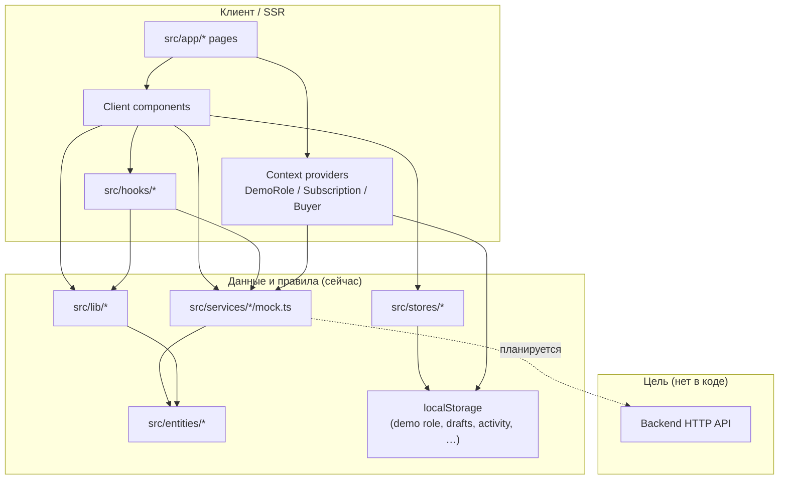

# Карта модулей и связанность

Связанные документы: [project-overview.md](./project-overview.md) · [what-is-implemented.md](./what-is-implemented.md) · [data-layer.md](./data-layer.md) · [configuration-and-security.md](./configuration-and-security.md) · [gaps-and-issues.md](./gaps-and-issues.md) · [future-foundation.md](./future-foundation.md)

---

## 2.1 Список модулей и слоёв

Ниже **логические модули** (не каждый файл). Для «кто импортирует» указаны **основные потребители**; полный граф импортов динамический — в репозитории сотни точек `from "@/services/..."` и `from "@/lib/..."`.

### Слой: платформа приложения (App Router + shell)

| Модуль | Расположение | Зона ответственности |
|--------|--------------|----------------------|
| Корневой layout | `src/app/layout.tsx` | Провайдеры (`DemoRoleProvider`, `SubscriptionProvider`, `BuyerProvider`, `AppProviders`, `ToastProvider`), оболочка `AppShell`, PWA `ServiceWorkerRegister`, плавающий переключатель роли |
| Глобальные стили | `src/app/globals.css` | Tailwind, базовые стили |
| Ошибки / 404 | `src/app/error.tsx`, `not-found.tsx` | Обработка ошибок маршрута |
| Web Vitals | `src/app/instrumentation-client.ts` | Проброс метрик в `trackWebVital` |
| SEO-маршруты | `src/app/robots.ts`, `sitemap.ts`, `manifest.ts` | Robots, sitemap, web manifest |

**Публичный интерфейс:** экспорт по умолчанию layout/page/error — соглашение Next.js.

**Зависимости:** `@/components/*`, `@/lib/seo/canonical` (`getSiteUrl`).

**Зависят от слоя:** все страницы как дочерние маршруты.

**Критичность:** высокая — любая ошибка ломает всё приложение.

**Зрелость:** реализовано.

---

### Слой: маршруты (доменные группы `src/app/`)

Маршруты сгруппированы по продуктовым областям. Каждая страница обычно импортирует **клиентский корень** из `src/components/<domain>/` или локальный `*Client.tsx`.

| Группа | Примеры путей | Назначение |
|--------|---------------|------------|
| Discovery / каталог | `/`, `/listings`, `/listings/[id]`, `/worlds`, `/create-listing` | Поиск, карточки, детали, создание |
| Stores | `/stores`, `/stores/[slug]`, `/sellers/[id]` | Каталог магазинов, витрина, legacy redirect |
| Requests | `/requests`, `/requests/[id]`, `/requests/new` | Доска запросов, детали, создание |
| Dashboard | `/dashboard`, `/dashboard/store` | Личный кабинет, кабинет магазина |
| Support | `/support/**`, тикеты | Справка, статьи, тикеты |
| Safety | `/safety/**` | Хаб безопасности, жалобы, гайды |
| Verification | `/verification/**`, `/verification/dev` | Верификация; dev-панель только в development |
| Enforcement | `/enforcement/**` | Санкции и апелляции (пользовательский хаб) |
| Admin | `/admin/**` | Внутренняя консоль (листинги, пользователи, модерация, подписки, промо, аналитика, система) |
| Прочее | `/messages`, `/notifications`, `/favorites`, `/pricing`, `/agriculture`, `/offline`, `/sponsor-board` | Сообщения, уведомления, избранное, тарифы, вертикаль, офлайн, спонсорские места |

**Публичный интерфейс:** сегменты Next — файловые конвенции.

**Зависимости:** компоненты, хуки, `src/lib/*`, `src/services/*`.

**Критичность:** распределённая; админ-модерация — высокая чувствительность по смыслу продукта.

**Зрелость:** UI в основном полный; данные везде mock.

---

### Слой: `src/components/` (по доменам)

Каждая подпапка — модуль представления. Ключевые «тяжёлые» композиции:

| Компонент / папка | Файлы-якоря | Роль |
|-------------------|-------------|------|
| `platform/` | `app-shell.tsx`, `PageShell.tsx`, `FeatureGate.tsx`, `app-providers.tsx` | Оболочка, гейты, общие провайдеры |
| `demo-role/` | `demo-role.tsx` | Роль демо, `DemoRoleGuard`, персист в `localStorage` |
| `subscription/` | `subscription-provider.tsx` | Тариф магазина / Pro для гейтов |
| `buyer/` | `buyer-provider.tsx` | Состояние покупателя + вызовы `src/services/buyer` |
| `listings/` | `listings-page-client.tsx`, `listing-details-page-client.tsx` | Каталог и детали |
| `create-listing/` | `create-listing-wizard.tsx`, схема, AI-хуки | Мастер создания объявления |
| `store-dashboard/` | `store-dashboard-page-client.tsx`, `sections/*` | Кабинет продавца по секциям |
| `moderation/`, `admin/` | очереди, `ModerationAccessGate`, shells | Внутренняя модерация и админ UI |
| `ui/` | кнопки, карточки, toast | Дизайн-примитивы |

**Зависимости:** сервисы, entities, lib, hooks, stores.

**Coupling:** крупные клиентские файлы смешивают запрос данных и UI (см. coupling ниже).

---

### Слой: `src/services/*` (доменные сервисы, runtime = mock)

Для каждого каталога: **индекс** обычно реэкспортирует типы и привязывает публичные функции к `mock.ts`.

| Модуль | Путь | Ответственность | Публичный API (суть) | Внутренние абстракции | Зависит от | Основные потребители |
|--------|------|-----------------|----------------------|------------------------|------------|------------------------|
| listings | `src/services/listings/` | CRUD + featured + home blocks | `ListingsService`, `getListings`, `createListing`, … | `mockListingsService`, типы в `types.ts` | `@/lib/listings.data`, entities | listings UI, homepage, sitemap |
| feature-gate | `src/services/feature-gate/` | Лимиты по тарифу | `FeatureGateService`, `createFeatureGateService`, `createMockFeatureGateService` | mock-политика | `@/entities/billing/model` | `useFeatureGate`, `FeatureGate` |
| buyer | `src/services/buyer/` | Избранное, промоут листинга, сценарии покупателя | `BuyerService`, `mockBuyerService` | `contracts.ts`, `mock.ts` | listings, entities | `BuyerProvider`, дашборд |
| requests | `src/services/requests/` | Запросы покупателей, отклики, матчинг | `getBuyerRequests`, `respondToBuyerRequest`, … | `matching.ts`, `intent-adapter.ts` | search-intent, lib | requests UI, дашборд |
| stores | `src/services/stores/` | Уведомления магазина (mock) | `getStoreNotifications`, sync-варианты | `mock.ts` | — | store UI |
| sellers | `src/services/sellers/` | Витрина + пакет дашборда продавца | `SellerService`, `mockSellerService` | `seller-data.ts`, mocks | marketing, listings lib | storefront, dashboard |
| marketing | `src/services/marketing/` | Кампании, купоны (mock) | `MarketingService` | `marketing-data.ts` | entities | store marketing workspace |
| verification | `src/services/verification/` | Статусы и шаги верификации | async API + `forceVerificationStatus` (dev) | `mock.ts` | — | verification pages |
| enforcement | `src/services/enforcement/` | Санкции, апелляции | функции из mock | `mock.ts` | — | enforcement UI, admin |
| risk | `src/services/risk/` | Сигналы риска, чеклист | `evaluateRisk`, mock | `rules.ts` | — | `RiskIndicator`, чеклист |
| moderation | `src/services/moderation/` | Очереди модерации | типы + mock ops | `access.ts` (гейт консоли) | `@/lib/admin-access` | admin moderation |
| support | `src/services/support/` | Статьи, тикеты | CRUD тикетов mock | `mock.ts` | lib категорий | support UI |
| safety | `src/services/safety/` | Жалобы, гайды | create/list mock | `mock.ts` | lib причин | safety UI |
| trust | `src/services/trust/` | Отзывы, trust score | `TrustService`, `mockTrustService` | mock | mocks/trust | trust widgets |
| analytics | `src/services/analytics/` | Аналитика витрины | `mockStoreAnalyticsService`, insights | `insights.ts`, `mock.ts` | entities | `StoreAnalyticsWorkspace` |
| billing | `src/services/billing/` | Счета, смена плана (mock) | `BillingService`, `mockBillingService` | mock | — | admin subscriptions |
| auth | `src/services/auth/` | Профиль аккаунта (mock) | `getProfileAccount`, stats, default fields | `mock.ts` | — | profile, navbar |
| auctions | `src/services/auctions/` | Ставки, правила аукциона | `AuctionService`, `mockAuctionService`, `getBidIncrement`, … | `rules.ts` | entities | auction UI |
| search-intent | `src/services/search-intent/` | Интент из фильтров / NL / image | `getSearchIntentFromFilters`, … | `mock.ts` | types | поиск, запросы |
| saved-searches | `src/services/saved-searches/` | Сохранённые поиски | mock сервис | `mock.ts` | — | `SavedSearchesProvider` |
| promotions | `src/services/promotions/` | Слоты, кампании, промо листингов (mock) | множество экспортов из index | `mock.ts` | admin search | admin promotions, store |
| admin | `src/services/admin/` | Поиск по сущностям, заметки, кейсы, подписки list | `filterAdminSearchHits`, mock bundles | `search-index.ts`, `cases-mock.ts`, `entity-notes-mock.ts` | listings/requests types, npm version | почти все `/admin/*` страницы |
| notifications | `src/services/notifications/` | Лента уведомлений mock | из `index.ts` | `mock.ts` | lib notifications | notifications UI |
| messages | `src/services/messages/` | Чаты | объект `messagesService` | `mock.ts` | — | messages split view, страницы |
| message-templates | `src/services/message-templates/` | Шаблоны ответов | `messageTemplatesService` | mock | — | composer |
| ai | `src/services/ai/` | Подсказки для листинга | `listing-assistant` + mock | mock, лимиты entities | `@/entities/ai` | create listing AI |
| entitlements | `src/services/entitlements/` | Политики tier для фич магазина, аукционов | `storeFeatureMinTier`, `canCreateAuction`, … | чистые функции | `DemoRole`, tier types из dashboard shared | мастер создания, гейты |

**Критическая точка отказа (логическая):** вся продуктовая функциональность завязана на **моки в памяти** — при перезагрузке часть состояния сбрасывается (кроме того, что в `localStorage` / zustand persist).

**Зрелость:** контракты частично выровнены под будущий HTTP; **HTTP-адаптеры отсутствуют** (нет `http.ts` в сервисах).

---

### Слой: `src/lib/` (утилиты и данные)

| Подмодуль | Путь | Роль |
|-----------|------|------|
| Listings | `listings.ts`, `listings.data.ts`, `listings.filters.ts`, `listings.types.ts` | Данные, фильтрация, типы каталога |
| Discovery / worlds | `discovery.ts`, `worlds.ts`, `worlds.community.ts` | Поисковая выдача, миры |
| SEO | `lib/seo/*` | canonical, metadata, structured data, breadcrumbs |
| Admin | `admin-access.ts`, `admin-internal-query.ts`, `admin-moderation-cross-links.ts`, … | Персоны админки, query-параметры, перекрёстные ссылки |
| Demo | `demo-role-constants.ts` | Константы ролей и seller id |
| Persistence demo | `seller-activity-storage.ts`, `saved-searches.ts` | localStorage обёртки |
| Monitoring | `monitoring.ts`, `observability/*` | Заглушки под Sentry / web vitals |
| Прочее | `dashboard.ts`, `messages-derived.ts`, `notifications.ts`, `profile-mock.ts`, … | Вспомогательная логика и мок-данные |

**Coupling:** многие страницы импортируют `lib` **напрямую**, минуя сервисный слой (двойной путь данных — см. раздел 2.3).

---

### Слой: `src/entities/`

Чистые типы: `billing`, `seller`, `marketing`, `requests`, `search`, `trust`, `analytics`, `auction`, `ai`. **Не зависят от React.** Используются сервисами и компонентами.

---

### Слой: `src/api/contracts/`

Только **типы** для будущего API: `auth`, `listings`, `notifications`, `requests`, `search`, `stores`, `uploads`, `users`. Реализация сервера отсутствует.

---

### Слой: `src/stores/`

| Файл | Назначение |
|------|------------|
| `listing-draft-store.ts` | Черновик мастера создания объявления (persist) |
| `ai-usage-store.ts` | Дневные лимиты AI |

---

### Слой: `src/hooks/`

| Файл | Назначение |
|------|------------|
| `useFeatureGate.ts` | Связка подписки + демо-роли с `createFeatureGateService` |
| `useAiListingGate.ts`, `useAiUsageEvents.ts` | AI лимиты |
| `hooks/data/*` | `useListings`, `useListing`, `useStorefront`, `useBuyerRequests`, кеш публикаций, saved search matches |

---

### Слой: `src/config/`

- `admin-routes.ts` — навигация админки (связано с `ADMIN_ROUTE_ACCESS` в `admin-access.ts`)
- `icons.ts` — конфиг иконок

---

### Слой: `src/mocks/`

Статические данные для биллинга, аналитики, аукционов, продавцов, trust — подключаются сервисами и тестами.

---

## 2.2 Граф зависимостей (текстовый)

Направление стрелки: **A --> B** значит «A зависит от B».

```
[Browser / User]
    --> [Next.js App Router: src/app/*]
          --> [src/components/* UI]
          --> [React Context: DemoRole, Subscription, Buyer, SavedSearches, Toast, …]
          --> [src/hooks/*]
                --> [src/services/*]
                --> [src/lib/*]
          --> [src/stores/*] --> [localStorage / zustand persist]

[src/services/*] --> [src/entities/*]
[src/services/*] --> [src/lib/*]          # часть сервисов
[src/services/*] --> [src/mocks/*]       # часть доменов
[src/components/*] --> [src/services/*]
[src/components/*] --> [src/lib/*]       # прямой доступ к данным/фильтрам
[src/lib/listings.*] --> [src/entities/*] # через типы листинга

[src/services/feature-gate] --> [entities/billing]
[src/hooks/useFeatureGate] --> [services/feature-gate] + [components/subscription] + [components/demo-role]

[src/services/moderation/access] --> [lib/admin-access] --> [lib/demo-role-constants]

[src/app/instrumentation-client] --> [lib/observability/web-vitals] --> [lib/monitoring]

[src/api/contracts/*]  # изолированные типы; UI может дублировать согласованность вручную

[CI: GitHub Actions] --> [npm: lint, typecheck, test, build]
[Production host] --> [next start] --> [static + RSC output]
```

Внешние системы **отсутствуют** в рантайме: **нет** `[HTTP API]`, **нет** `[PostgreSQL]` в текущей сборке.

### Диаграмма Mermaid



---

## 2.3 Связанность (coupling / cohesion)

### Жёсткие связи
- **Двойной путь к данным:** часть UI зовёт `src/services/listings`, часть — напрямую `src/lib/listings*`, `discovery.ts` (усложняет замену на API).
- **Крупные клиентские модули:** `create-listing-wizard.tsx`, `listings-page-client.tsx`, `store-dashboard-page-client.tsx`, `storefront-page-client.tsx` концентрируют бизнес-ветвления и представление — **низкая cohesion** внутри файла, высокая связность с множеством сервисов.
- **`entitlements/config.ts`** импортирует типы из **компонента** (`store-dashboard-shared`) — инверсия слоя (domain-ish config зависит от UI-типа).

### Циклические зависимости
Явных циклов пакетного уровня в аудите не зафиксировано; риск — при росте «lib ↔ services ↔ components» без границ.

### Нарушение SRP
- Админские страницы совмещают загрузку mock-данных, фильтры URL и отрисовку (`useAdminUrlFilters`, клиенты очередей).
- `src/services/admin/mock.ts` — крупный монолит сценариев админки.

### Кандидаты на вынос в пакет / микросервис
- **`src/api/contracts`** + **`src/entities`** — уже близки к shared SDK для фронта и бэка.
- **`src/services/listings` + `lib/listings.filters`** — ядро каталога.
- **`src/services/moderation` + admin UI** — изолированный trust & safety bounded context (в перспективе отдельное приложение или BFF).

---

## Сводка по количеству логических модулей

- **~27** доменных папок в `src/services/`
- **~11** файлов в `src/entities/`
- **~40+** подпапок в `src/components/` (плюс `ui`)
- **~118** файлов маршрутов/сегментов в `src/app/` (включая вложенные)
- **9** контрактных файлов в `src/api/contracts/`

Точное число «модулей» зависит от гранулярности; для стратегии достаточно считать **десятки доменных блоков** с пересечением через общие lib/context.
